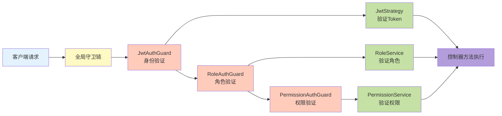
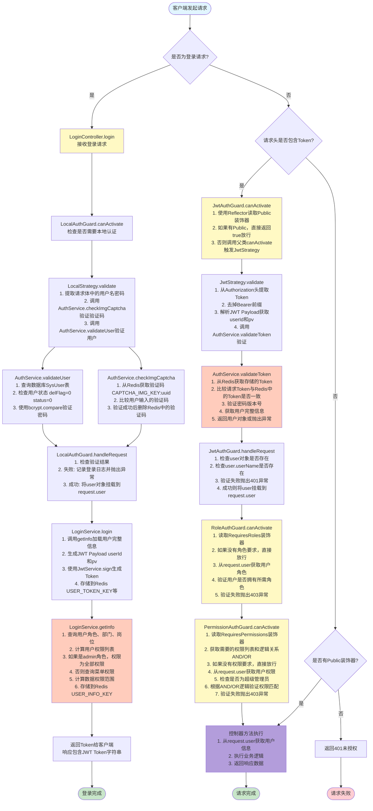
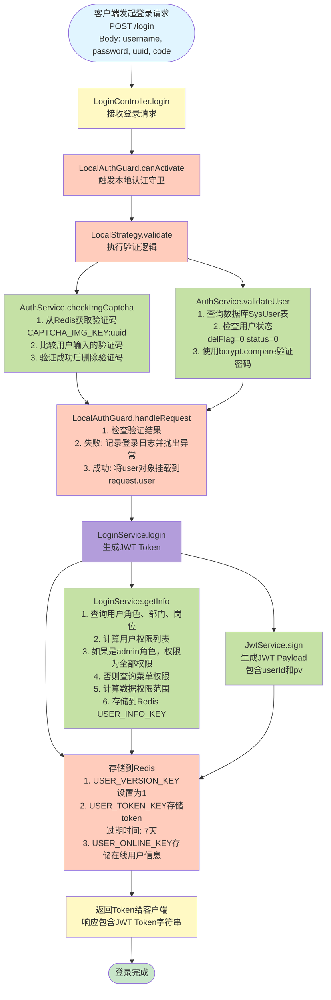
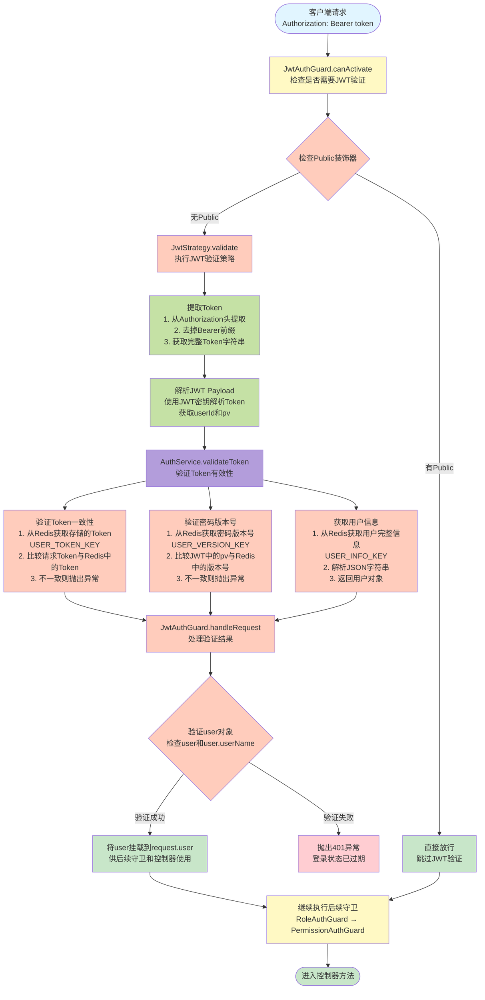
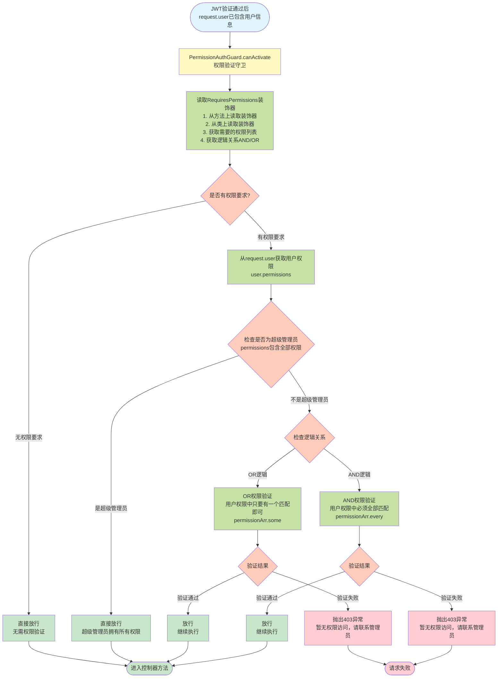

# NestJS 鉴权流程完整分析

> 本文档详细分析了基于 NestJS + Passport.js + JWT 的完整鉴权流程，包含登录验证、Token 管理、权限控制等核心机制。

## 📋 目录

- [技术栈概览](#技术栈概览)
- [核心概念](#核心概念)
- [整体架构](#整体架构)
- [登录流程详解](#登录流程详解)
- [JWT 验证流程](#jwt-验证流程)
- [权限验证流程](#权限验证流程)
- [Redis 存储结构](#redis-存储结构)
- [安全机制](#安全机制)
- [关键代码解析](#关键代码解析)
- [流程图](#流程图)
- [常见问题](#常见问题)

---

## 技术栈概览

本项目采用以下技术实现鉴权系统：

- **NestJS**: 企业级 Node.js 框架
- **Passport.js**: 认证中间件，支持多种认证策略
- **JWT (JSON Web Token)**: 无状态的身份验证机制
- **Redis**: 存储 Token、用户信息、权限数据
- **bcrypt**: 密码加密

---

## 核心概念

### 1. 策略（Strategy）

策略定义了**如何验证用户身份**。本项目使用两种策略：

- **LocalStrategy**: 本地登录策略，验证用户名和密码
- **JwtStrategy**: JWT 验证策略，验证 Token 的有效性

### 2. 守卫（Guard）

守卫控制**谁可以访问哪些路由**。守卫在路由处理器执行前运行，决定是否允许请求继续。

本项目使用以下守卫：

- **LocalAuthGuard**: 登录守卫，用于登录接口
- **JwtAuthGuard**: JWT 守卫，全局守卫，验证所有需要登录的接口
- **PermissionAuthGuard**: 权限守卫，全局守卫，验证用户是否有权限访问
- **RoleAuthGuard**: 角色守卫，全局守卫，验证用户角色

### 3. 装饰器（Decorator）

装饰器用于**标记路由的元数据**：

- `@Public()`: 标记为公开接口，跳过 JWT 验证
- `@RequiresPermissions()`: 标记接口需要的权限
- `@RequiresRoles()`: 标记接口需要的角色

### 4. 服务（Service）

服务处理**业务逻辑**：

- **AuthService**: 处理验证码、用户验证、Token 验证
- **LoginService**: 处理登录、生成 Token、获取用户信息

---

## 整体架构



---

## 整体流程分析图

以下流程图详细展示了从用户登录到访问受保护接口的完整鉴权流程，每个节点都标注了内部执行的具体操作：



### 流程说明

#### 登录流程（左侧分支）

1. **LoginController** → 接收登录请求，包含用户名、密码、验证码UUID和验证码
2. **LocalAuthGuard** → 触发本地认证守卫
3. **LocalStrategy.validate** → 执行验证逻辑
4. **AuthService.checkImgCaptcha** → 验证图片验证码（从Redis获取并比较）
5. **AuthService.validateUser** → 验证用户名和密码（查询数据库并使用bcrypt验证）
6. **LocalAuthGuard.handleRequest** → 处理验证结果，将用户对象挂载到request
7. **LoginService.login** → 生成JWT Token并存储到Redis
8. **LoginService.getInfo** → 加载用户完整信息（角色、权限、数据权限）并缓存

#### 后续请求流程（右侧分支）

1. **JwtAuthGuard** → 检查是否为公开接口，如果不是则验证Token
2. **JwtStrategy.validate** → 提取并解析JWT Token
3. **AuthService.validateToken** → 验证Token有效性（一致性、密码版本号、获取用户信息）
4. **JwtAuthGuard.handleRequest** → 将验证后的用户对象挂载到request
5. **RoleAuthGuard** → 验证用户角色（如果有角色要求）
6. **PermissionAuthGuard** → 验证用户权限（如果有权限要求）
7. **Controller** → 执行业务逻辑并返回响应

#### 关键验证点

- **验证码验证**: 防止暴力破解，一次性使用
- **密码验证**: 使用bcrypt哈希比较，安全可靠
- **Token一致性**: 确保客户端Token与服务器存储的一致
- **密码版本号**: 防止密码修改后旧Token仍可使用
- **角色验证**: 基于用户角色的访问控制
- **权限验证**: 基于细粒度权限的访问控制，支持AND/OR逻辑

---

## 登录流程详解

### 流程图



### 详细步骤

#### 步骤 1: 客户端发起登录请求

```typescript
POST /login
Body: {
  username: "admin",
  password: "123456",
  uuid: "验证码UUID",
  code: "验证码"
}
```

#### 步骤 2: LoginController 接收请求

```typescript
@Post('login')
@Public()                    // 标记为公开接口，跳过 JWT 验证
@UseGuards(LocalAuthGuard)   // 使用本地登录守卫
async login(
  @Body() reqLoginDto: ReqLoginDto,
  @User() user: SysUser,      // 从 request.user 获取验证后的用户
  @Req() req: Request,
): Promise<ResLoginDto> {
  return await this.loginService.login(user, req);
}
```

#### 步骤 3: LocalAuthGuard 拦截请求

```typescript
export class LocalAuthGuard extends AuthGuard('local') {
  canActivate(context: ExecutionContext) {
    // 调用父类的 canActivate，会触发 LocalStrategy.validate()
    return super.canActivate(context);
  }

  handleRequest(err, user, info) {
    // 处理验证结果
    if (err || !user) {
      // 记录登录失败日志
      this.loginInforService.addLoginInfor(request, err.response, '1');
      throw err || new ApiException('用户名或密码错误');
    }
    // 返回用户对象，会被挂载到 request.user
    return user;
  }
}
```

#### 步骤 4: LocalStrategy 验证用户

```typescript
export class LocalStrategy extends PassportStrategy(Strategy) {
  async validate(request, username: string, password: string) {
    const body: ReqLoginDto = request.body;

    // 1. 验证图片验证码
    await this.authService.checkImgCaptcha(body.uuid, body.code);

    // 2. 验证用户名和密码
    const user = await this.authService.validateUser(username, password);

    // 返回值会被 LocalAuthGuard.handleRequest() 接收
    return user;
  }
}
```

**验证码验证逻辑**：

```typescript
async checkImgCaptcha(uuid: string, code: string) {
  // 从 Redis 获取验证码
  const result = await this.redis.get(`${CAPTCHA_IMG_KEY}:${uuid}`);

  // 验证码不存在或不匹配
  if (isEmpty(result) || code.toLowerCase() !== result.toLowerCase()) {
    throw new ApiException('验证码错误');
  }

  // 验证成功后删除验证码（一次性使用）
  await this.redis.del(`${CAPTCHA_IMG_KEY}:${uuid}`);
}
```

**用户验证逻辑**：

```typescript
async validateUser(userName: string, password: string) {
  // 查询用户（包含部门信息）
  const user = await this.prisma.sysUser.findUnique({
    include: { dept: true },
    where: {
      userName,
      delFlag: '0',  // 未删除
      status: '0',   // 正常状态
    },
  });

  if (!user) throw new ApiException('用户名或密码错误');

  // 使用 bcrypt 验证密码
  const isMatch = await bcrypt.compare(password, user.password);
  if (!isMatch) throw new ApiException('用户名或密码错误');

  return user;
}
```

#### 步骤 5: LoginService 生成 Token

```typescript
async login(user: SysUser, req: Request) {
  const { userId } = user;

  // 1. 加载用户完整信息（角色、权限、数据权限）
  await this.getInfo(userId);

  // 2. 生成 JWT Payload
  const payload: Payload = { userId, pv: 1 };  // pv: password version

  // 3. 生成 JWT Token
  let jwtSign = this.jwtService.sign(payload);

  // 4. 演示环境特殊处理（复用 token，取消单点登录）
  if (this.configService.get<boolean>('isDemoEnvironment')) {
    const token = await this.redis.get(`${USER_TOKEN_KEY}:${userId}`);
    if (token) {
      jwtSign = token;  // 复用已有 token
    }
  }

  // 5. 设置过期时间（默认 7 天）
  const expiresIn = this.configService.get('expiresIn') || 60 * 60 * 24 * 7;

  // 6. 记录登录成功日志
  const addLoginInforDto = await this.loginInforService.addLoginInfor(
    req,
    '登录成功',
    '0',
  );

  // 7. 存储到 Redis
  await this.redis
    .pipeline()
    .set(`${USER_VERSION_KEY}:${userId}`, 1)              // 密码版本号
    .set(`${USER_TOKEN_KEY}:${userId}`, jwtSign, 'EX', expiresIn)  // Token
    .set(`${USER_ONLINE_KEY}:${userId}`, JSON.stringify(onlineObj), 'EX', expiresIn)  // 在线用户
    .exec();

  return { token: jwtSign };
}
```

**getInfo() 方法详解**：

```typescript
async getInfo(userId: number) {
  // 1. 查询用户完整信息
  const user = await this.prisma.sysUser.findUnique({
    where: { userId, status: '0', delFlag: '0' },
    include: {
      roles: { where: { delFlag: '0', status: '0' } },
      dept: { where: { delFlag: '0', status: '0' } },
      posts: { where: { status: '0' } },
    },
  });

  if (!user) throw new ApiException('用户不存在', 401);

  // 2. 计算用户权限
  const roles = user.roles.map((item) => item.roleKey);
  let permissions = [];

  if (roles.includes('admin')) {
    // 管理员拥有所有权限
    permissions = ['*:*:*'];
  } else {
    // 查询用户角色关联的菜单权限
    const menus = await this.prisma.sysMenu.findMany({
      select: { perms: true },
      where: {
        perms: { not: null, not: '' },
        status: '0',
        roles: {
          some: {
            status: '0',
            delFlag: '0',
            users: {
              some: {
                status: '0',
                delFlag: '0',
                userId: userId,
              },
            },
          },
        },
      },
    });
    permissions = menus.map((item) => item.perms);
  }

  // 3. 获取数据权限范围
  const dataScope = await this.getDataScope(user.roles, user);

  // 4. 存储到 Redis
  this.redis.set(
    `${USER_INFO_KEY}:${userId}`,
    JSON.stringify({
      ...user,
      permissions,
      dataScope,
    }),
  );
}
```

---

## JWT 验证流程

### 流程图



### 详细步骤

#### 步骤 1: JwtAuthGuard 拦截请求

```typescript
export class JwtAuthGuard extends AuthGuard('jwt') {
  constructor(private reflector: Reflector) {
    super();
  }

  canActivate(context: ExecutionContext) {
    // 检查是否有 @Public() 装饰器
    const noInterception = this.reflector.getAllAndOverride(PUBLIC_KEY, [
      context.getHandler(), // 方法上的装饰器
      context.getClass(), // 类上的装饰器
    ]);

    // 如果是公开接口，直接放行
    if (noInterception) return true;

    // 否则调用父类方法，触发 JwtStrategy.validate()
    return super.canActivate(context);
  }

  handleRequest(err, user, info) {
    // 处理验证结果
    if (err || !user || !user.userName) {
      throw err || new ApiException('登录状态已过期', 401);
    }
    // 返回用户对象，挂载到 request.user
    return user;
  }
}
```

#### 步骤 2: JwtStrategy 验证 Token

```typescript
export class JwtStrategy extends PassportStrategy(Strategy) {
  constructor(private readonly authService: AuthService) {
    super({
      jwtFromRequest: ExtractJwt.fromAuthHeaderAsBearerToken(), // 从 Bearer Token 提取
      ignoreExpiration: false, // 不忽略过期时间
      secretOrKey: jwtConstants.secret, // JWT 密钥
      passReqToCallback: true, // 传递 request 对象
    });
  }

  async validate(request: Request, payload: Payload) {
    const { userId, pv } = payload; // 从 JWT Payload 获取用户ID和密码版本

    // 从请求头提取完整 Token
    const authorization = (request.headers as any).authorization || '';
    const token = authorization.slice(7); // 去掉 "Bearer " 前缀

    // 验证 Token 有效性
    const user = await this.authService.validateToken(userId, pv, token);

    // 返回值会被 JwtAuthGuard.handleRequest() 接收
    return user || { userId };
  }
}
```

#### 步骤 3: AuthService 验证 Token

```typescript
async validateToken(userId: number, pv: number, restoken: string) {
  // 1. 验证 Token 是否与 Redis 中存储的一致
  const token = await this.redis.get(`${USER_TOKEN_KEY}:${userId}`);
  if (restoken !== token) {
    throw new ApiException('登录状态已过期', 401);
  }

  // 2. 验证密码版本号（防止登录期间密码被修改后仍能继续使用）
  const passwordVersion = await this.redis.get(`${USER_VERSION_KEY}:${userId}`);
  if (pv.toString() !== passwordVersion) {
    throw new ApiException('用户信息或全权限范围已被修改', 401);
  }

  // 3. 获取用户完整信息（包含权限、角色、数据权限）
  const userString = await this.redis.get(`${USER_INFO_KEY}:${userId}`);
  if (userString) {
    return JSON.parse(userString);
  }
}
```

**验证机制说明**：

1. **Token 一致性验证**: 确保客户端使用的 Token 与服务器存储的一致，防止 Token 被篡改或使用已注销的 Token
2. **密码版本号验证**: 当用户密码被修改时，会更新密码版本号，旧的 Token 将失效
3. **用户信息缓存**: 从 Redis 获取用户信息，避免频繁查询数据库

---

## 权限验证流程

### 流程图



### 详细步骤

```typescript
export class PermissionAuthGuard implements CanActivate {
  constructor(
    private reflector: Reflector,
    @InjectRedis() private readonly redis: Redis,
  ) {}

  async canActivate(context: ExecutionContext) {
    // 1. 读取权限元数据
    const permissionObj = this.reflector.getAllAndOverride<PermissionObj>(
      PERMISSION_KEY_METADATA,
      [context.getHandler(), context.getClass()],
    );

    // 2. 如果没有权限要求，直接放行
    if (!permissionObj || !permissionObj.permissionArr.length) {
      return true;
    }

    // 3. 获取用户信息
    const request = context.switchToHttp().getRequest();
    const user = request.user;
    const permissions = user?.permissions || [];

    // 4. 超级管理员拥有所有权限
    if (permissions.includes('*:*:*')) {
      return true;
    }

    // 5. 权限匹配验证
    let result = false;

    if (permissionObj.logical === LogicalEnum.or) {
      // OR 逻辑：只要有一个权限匹配即可
      result = permissionObj.permissionArr.some((userPermission) => {
        return permissions.includes(userPermission);
      });
    } else if (permissionObj.logical === LogicalEnum.and) {
      // AND 逻辑：所有权限都必须匹配
      result = permissionObj.permissionArr.every((userPermission) => {
        return permissions.includes(userPermission);
      });
    }

    // 6. 验证失败，抛出异常
    if (!result) {
      throw new ApiException('暂无权限访问，请联系管理员');
    }

    return result;
  }
}
```

**使用示例**：

```typescript
// 需要单个权限
@RequiresPermissions('system:user:list')
@Get('list')
async getUserList() {
  // ...
}

// 需要多个权限（AND 关系）
@RequiresPermissions('system:user:edit', 'system:user:add', LogicalEnum.and)
@Post('save')
async saveUser() {
  // ...
}

// 需要多个权限（OR 关系）
@RequiresPermissions('system:user:edit', 'system:user:view', LogicalEnum.or)
@Get('detail')
async getUserDetail() {
  // ...
}
```

---

## Redis 存储结构

### Key 命名规范

所有 Redis Key 都使用常量定义，便于管理和维护：

```typescript
// 验证码
CAPTCHA_IMG_KEY:${uuid} = "验证码值"

// 用户 Token
USER_TOKEN_KEY:${userId} = "JWT Token字符串"

// 密码版本号
USER_VERSION_KEY:${userId} = "1"

// 用户完整信息（JSON字符串）
USER_INFO_KEY:${userId} = {
  userId: 1,
  userName: "admin",
  nickName: "管理员",
  permissions: ["system:user:list", "system:user:add"],
  roles: [{ roleId: 1, roleKey: "admin" }],
  dataScope: { type: "all", deptIds: [] }
}

// 在线用户信息
USER_ONLINE_KEY:${userId} = {
  tokenId: "USER_TOKEN_KEY:1",
  deptName: "技术部",
  loginTime: "2024-01-01 10:00:00",
  // ... 其他登录信息
}
```

### 过期时间设置

- **验证码**: 5 分钟（300 秒）
- **Token**: 7 天（604800 秒）
- **用户信息**: 无过期时间（登录时更新）
- **在线用户**: 7 天（与 Token 同步）

---

## 安全机制

### 1. 密码加密

使用 `bcrypt` 对密码进行哈希加密：

```typescript
// 注册时加密密码
const hashedPassword = await bcrypt.hash(password, 10);

// 登录时验证密码
const isMatch = await bcrypt.compare(password, user.password);
```

### 2. Token 管理

- **单点登录**: 同一用户只能有一个有效 Token（演示环境除外）
- **Token 过期**: Token 设置过期时间，过期后需重新登录
- **主动注销**: 退出登录时删除 Redis 中的 Token

### 3. 密码版本号

当用户密码或权限被修改时，更新密码版本号，使旧 Token 失效：

```typescript
// 修改密码或权限后
await this.redis.set(`${USER_VERSION_KEY}:${userId}`, newVersion);
```

### 4. 验证码机制

- 图片验证码防止暴力破解
- 验证码一次性使用，验证后立即删除
- 验证码存储在 Redis，5 分钟过期

### 5. 状态检查

所有用户查询都会检查：

- `delFlag: '0'`: 用户未被删除
- `status: '0'`: 用户状态正常

---

## 关键代码解析

### 1. 全局守卫配置

在 `shared.module.ts` 中配置全局守卫：

```typescript
{
  provide: APP_GUARD,
  useClass: JwtAuthGuard,        // 第一个执行：身份验证
},
{
  provide: APP_GUARD,
  useClass: RoleAuthGuard,        // 第二个执行：角色验证
},
{
  provide: APP_GUARD,
  useClass: PermissionAuthGuard,  // 第三个执行：权限验证
},
```

**执行顺序**：JwtAuthGuard → RoleAuthGuard → PermissionAuthGuard

### 2. Public 装饰器

```typescript
export const Public = () => SetMetadata(PUBLIC_KEY, true);
```

使用方式：

```typescript
@Public()  // 标记为公开接口，跳过 JWT 验证
@Get('public')
async publicEndpoint() {
  // ...
}
```

### 3. User 装饰器

从 `request.user` 中提取用户信息：

```typescript
@Get('profile')
async getProfile(@User() user: UserInfo) {
  // user 包含完整的用户信息、权限、角色等
  return user;
}

// 也可以提取特定字段
@Get('userId')
async getUserId(@User(UserEnum.userId) userId: number) {
  return { userId };
}
```

### 4. 退出登录

```typescript
@Post('logout')
@Public()
async logout(@Headers('Authorization') authorization: string) {
  if (authorization) {
    const token = authorization.slice(7);  // 去掉 "Bearer " 前缀
    await this.loginService.logout(token);
  }
}
```

退出登录逻辑：

```typescript
async logout(token: string) {
  try {
    // 解析 Token 获取 userId
    const payload = this.jwtService.verify(token) as Payload;
    const { userId } = payload;

    // 删除 Redis 中的相关数据
    await this.redis
      .pipeline()
      .del(`${USER_TOKEN_KEY}:${userId}`)
      .del(`${USER_INFO_KEY}:${userId}`)
      .del(`${USER_ONLINE_KEY}:${userId}`)
      .exec();
  } catch (error) {
    // Token 无效或已过期，忽略错误
  }
}
```

---

## 流程图

### 完整请求流程

```mermaid
graph TD
    Start(["客户端请求<br/>Authorization: Bearer token"]) --> Guard1["JwtAuthGuard<br/>身份验证守卫"]

    Guard1 --> CheckPublic{检查Public装饰器}
    CheckPublic -->|有Public| SkipJWT[直接放行<br/>跳过JWT验证]
    CheckPublic -->|无Public| JwtStrategy["JwtStrategy.validate<br/>1. 提取Token<br/>2. 解析Payload userId和pv<br/>3. 调用validateToken验证"]

    JwtStrategy --> ValidateToken["AuthService.validateToken<br/>1. 验证Token一致性<br/>2. 验证密码版本号<br/>3. 获取用户信息"]

    ValidateToken --> HandleRequest1["JwtAuthGuard.handleRequest<br/>将user挂载到request.user"]

    HandleRequest1 --> Guard2["RoleAuthGuard<br/>角色验证守卫"]
    SkipJWT --> Guard2

    Guard2 --> CheckRoles{检查RequiresRoles装饰器}
    CheckRoles -->|无角色要求| SkipRole[直接放行]
    CheckRoles -->|有角色要求| ValidateRole["验证用户角色<br/>检查用户是否拥有所需角色"]

    ValidateRole --> Guard3["PermissionAuthGuard<br/>权限验证守卫"]
    SkipRole --> Guard3

    Guard3 --> CheckPerms{检查RequiresPermissions装饰器}
    CheckPerms -->|无权限要求| SkipPerm[直接放行]
    CheckPerms -->|有权限要求| CheckAdmin{是否为超级管理员<br/>全部权限}

    CheckAdmin -->|是| SkipPerm
    CheckAdmin -->|否| ValidatePerm["验证用户权限<br/>根据AND/OR逻辑验证权限匹配"]

    ValidatePerm --> Controller["控制器方法执行<br/>1. 从request.user获取用户信息<br/>2. 执行业务逻辑<br/>3. 返回响应数据"]
    SkipPerm --> Controller

    Controller --> End([请求完成])

    style Start fill:#e1f5ff
    style End fill:#c8e6c9
    style Guard1 fill:#fff9c4
    style Guard2 fill:#fff9c4
    style Guard3 fill:#fff9c4
    style CheckPublic fill:#ffccbc
    style SkipJWT fill:#c8e6c9
    style JwtStrategy fill:#ffccbc
    style ValidateToken fill:#c5e1a5
    style HandleRequest1 fill:#ffccbc
    style CheckRoles fill:#ffccbc
    style SkipRole fill:#c8e6c9
    style ValidateRole fill:#c5e1a5
    style CheckPerms fill:#ffccbc
    style SkipPerm fill:#c8e6c9
    style CheckAdmin fill:#ffccbc
    style ValidatePerm fill:#c5e1a5
    style Controller fill:#b39ddb
```



---

## 常见问题

### Q1: 为什么需要密码版本号（pv）？

**A**: 密码版本号用于防止以下场景：

- 用户登录后，管理员修改了用户的密码或权限
- 用户仍使用旧的 Token 继续访问系统
- 通过检查密码版本号，可以强制旧 Token 失效，要求用户重新登录

### Q2: Token 存储在 Redis 中，是否违背了 JWT 无状态的原则？

**A**: 这是一个权衡：

- **优点**: 可以实现 Token 的主动注销、单点登录、密码版本号验证等高级功能
- **缺点**: 需要依赖 Redis，增加了系统复杂度
- **建议**: 如果不需要这些功能，可以使用纯 JWT 无状态方案

### Q3: 如何实现单点登录（SSO）？

**A**: 当前实现已经支持单点登录：

- 同一用户登录时，会覆盖 Redis 中旧的 Token
- 旧 Token 在验证时会发现与 Redis 中的不一致，从而失效
- 演示环境通过复用 Token 来取消单点登录限制

### Q4: 权限验证失败时，如何自定义错误信息？

**A**: 可以在 `PermissionAuthGuard` 中修改异常信息：

```typescript
if (!result) {
  throw new ApiException('暂无权限访问，请联系管理员', 403);
}
```

### Q5: 如何调试鉴权流程？

**A**: 可以在关键位置添加日志：

```typescript
// 在守卫中添加
console.log('JwtAuthGuard - canActivate', context.getHandler().name);

// 在策略中添加
console.log('JwtStrategy - validate', payload);

// 在服务中添加
console.log('AuthService - validateToken', userId, pv);
```

### Q6: 如何扩展权限验证逻辑？

**A**: 可以修改 `PermissionAuthGuard` 的 `canActivate` 方法，添加自定义验证逻辑：

```typescript
async canActivate(context: ExecutionContext) {
  // 原有逻辑...

  // 添加自定义验证
  const customCheck = await this.customPermissionService.check(user);
  if (!customCheck) {
    throw new ApiException('自定义权限验证失败');
  }

  return result;
}
```

---

## 总结

本项目的鉴权系统采用了**多层守卫 + Passport 策略 + Redis 缓存**的架构，实现了：

✅ **身份验证**: 通过 JWT Token 验证用户身份  
✅ **权限控制**: 基于角色的权限访问控制（RBAC）  
✅ **安全机制**: 密码加密、验证码、Token 管理、密码版本号  
✅ **性能优化**: Redis 缓存用户信息和权限，减少数据库查询  
✅ **灵活扩展**: 支持公开接口、权限装饰器、自定义验证逻辑

通过理解本文档，您可以：

- 快速理解整个鉴权流程
- 定位和解决鉴权相关问题
- 根据需求扩展和定制鉴权功能
- 在其他项目中复用类似的鉴权方案

---

**文档版本**: v1.0  
**最后更新**: 2024-12-19  
**作者**: AI Assistant
