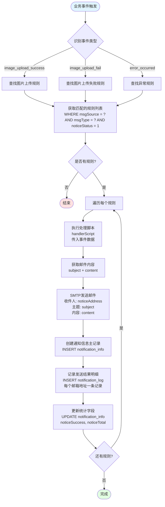
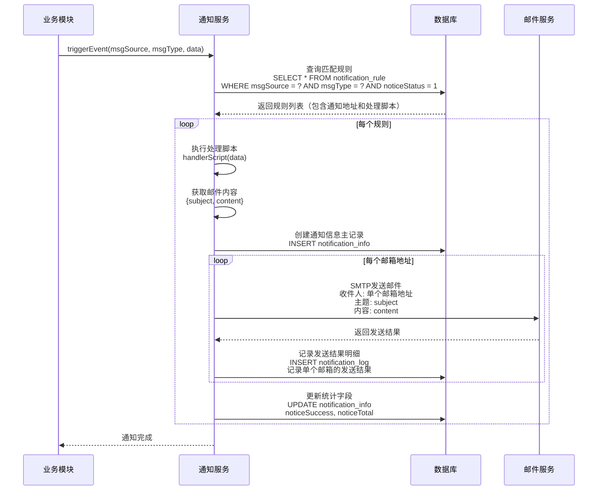
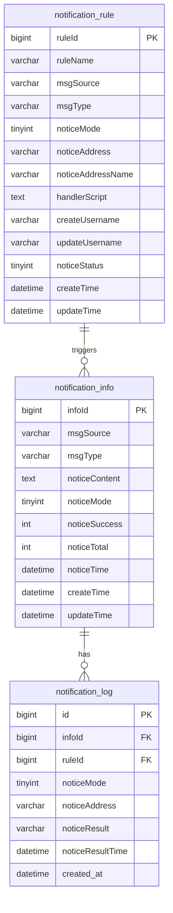
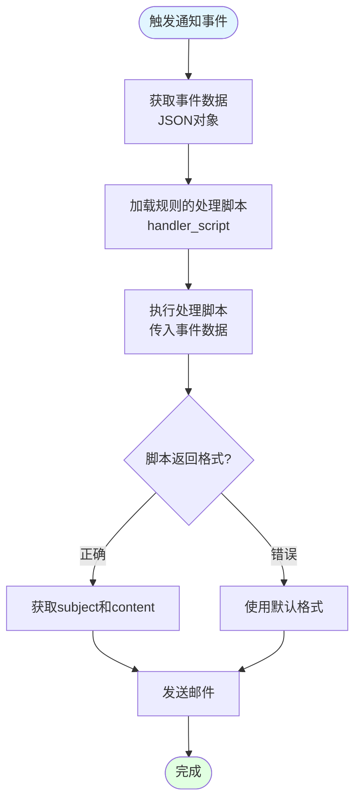

# 通知模块架构设计文档

## 1. 概述

通知模块是一个灵活、可扩展的通知管理系统，通过规则配置和模版管理，实现业务事件到通知消息的自动化转换和发送。**当前版本仅支持邮箱通知方式**。

### 1.1 核心特性

- **邮箱通知支持**：支持通过 SMTP 发送邮件通知
- **规则驱动**：通过规则配置实现事件到通知的映射
- **处理脚本**：支持自定义 JavaScript 处理脚本，灵活处理通知内容格式
- **完整日志记录**：记录所有通知发送历史，便于追踪和排查
- **易于扩展**：新增事件类型无需修改核心代码

### 1.2 应用场景

- 图片上传成功/失败通知
- 系统异常告警通知
- 其他业务事件通知

## 2. 流程设计

### 2.1 整体流程

通知模块采用**事件驱动**的架构模式，整个流程如下：

```
业务事件发生
  → 识别消息来源和消息类型
  → 匹配通知规则（规则中配置了处理脚本和通知地址）
  → 执行处理脚本（生成邮件主题和内容）
  → 发送邮件通知（每个邮箱地址单独发送）
  → 创建通知信息主记录
  → 记录发送结果明细
  → 更新统计信息
```

### 2.2 详细流程说明

#### 2.2.1 事件触发阶段

当业务系统中发生特定事件时（如图片上传、异常等），调用通知服务的触发接口：

```typescript
// 示例：图片上传成功
notificationService.triggerEvent('image_upload', 'success', {
  image_name: 'photo.jpg',
  image_size: '2.5MB',
  upload_time: '2024-01-15 10:30:00',
  uploader: 'username',
});
```

#### 2.2.2 规则匹配阶段

系统根据消息来源和消息类型查询数据库中所有匹配的、已启用的通知规则：

```sql
SELECT * FROM notification_rule
WHERE msgSource = 'image_upload'
  AND msgType = 'success'
  AND noticeStatus = 1;
```

一个事件类型可以匹配多个规则，实现同时发送到多个邮箱地址。

**规则的作用**：

- 配置了通知目标（邮箱地址，支持多个邮箱用逗号分隔）
- 配置了处理脚本（用于格式化通知内容）
- 指定了消息来源和消息类型（用于规则匹配）

#### 2.2.3 内容处理阶段

对于每个匹配的规则，系统使用规则中配置的 `handlerScript`（处理脚本）来处理事件数据。

**关键点**：

- 处理脚本是 JavaScript 代码，接收事件数据作为参数
- 处理脚本需要返回一个包含 `subject`（邮件主题）和 `content`（邮件内容）的对象
- 如果处理脚本返回的格式不正确，系统会使用默认格式

#### 2.2.4 内容渲染阶段

执行处理脚本，将事件数据转换为邮件内容：

- 事件数据：`{ image_name: 'photo.jpg', image_size: '2.5MB', ... }`
- 处理脚本：执行规则中配置的 `handlerScript`
- 渲染结果：`{ subject: '图片上传完成 - photo.jpg', content: '<h2>图片上传完成</h2><p>图片名: photo.jpg</p>...' }`

#### 2.2.5 通知发送阶段

使用 SMTP 发送邮件通知：

- **邮箱通知**：使用 SMTP 协议发送邮件
- 邮件主题：使用处理脚本返回的 `subject`
- 邮件内容：使用处理脚本返回的 `content`（支持 HTML 格式）
- 收件人：规则中配置的 `noticeAddress`（支持多个邮箱，用逗号分隔）

#### 2.2.6 日志记录阶段

无论发送成功或失败，都会记录到数据库中，包括：

1. **notification_info 表**：记录通知信息主记录
   - 消息来源、消息类型
   - 通知内容
   - 通知时间
   - 成功数和总数（统计字段）

2. **notification_log 表**：记录每个邮箱地址的发送结果
   - 关联的通知信息 ID
   - 使用的规则 ID
   - 通知地址（单个邮箱）
   - 发送结果和结果时间

### 2.3 流程图



### 2.4 时序图



## 3. 数据库设计

### 3.1 表结构总览

通知模块共包含三个核心表：

1. **notification_rule**：通知规则表（包含处理脚本）
2. **notification_info**：通知信息主表（记录每次通知触发的主记录）
3. **notification_log**：通知发送结果明细表（记录每个通知地址的发送结果）

### 3.2 表关系图



### 3.3 详细表结构

#### 3.3.1 notification_rule（通知规则表）

存储通知规则配置，定义消息来源、消息类型与通知方式的映射关系。**规则中包含处理脚本，用于格式化通知内容**。

| 字段名            | 类型         | 约束                                                  | 说明                                                                                                                                                    |
| ----------------- | ------------ | ----------------------------------------------------- | ------------------------------------------------------------------------------------------------------------------------------------------------------- |
| ruleId            | BIGINT       | PK, AUTO_INCREMENT                                    | 主键 ID                                                                                                                                                 |
| ruleName          | VARCHAR(100) | NOT NULL                                              | 规则名称，如"图片上传成功通知"                                                                                                                          |
| msgSource         | VARCHAR(50)  | NOT NULL                                              | 消息来源，用于规则匹配，如"image_upload"                                                                                                                |
| msgType           | VARCHAR(50)  | NOT NULL                                              | 消息类型，用于规则匹配，如"success"、"fail"                                                                                                             |
| noticeMode        | TINYINT      | NOT NULL, DEFAULT 3                                   | 通知方式：<br/>- 3：邮箱（EMAIL）<br/>**当前版本仅支持邮箱**                                                                                            |
| noticeAddress     | VARCHAR(500) | NOT NULL                                              | **通知地址（邮箱地址）**：<br/>- 支持多个邮箱，用英文逗号分隔<br/>- 如："dev@example.com,test@example.com"                                              |
| noticeAddressName | VARCHAR(100) | NULL                                                  | 通知地址名称（主要用于企微群，邮箱通知可为空）                                                                                                          |
| handlerScript     | TEXT         | NULL                                                  | **处理脚本（JavaScript 代码）**：<br/>- 用于格式化通知内容<br/>- 接收事件数据作为参数<br/>- 需要返回包含 `subject` 和 `content` 的对象<br/>- 示例见下方 |
| createUsername    | VARCHAR(50)  | NULL                                                  | 创建人                                                                                                                                                  |
| updateUsername    | VARCHAR(50)  | NULL                                                  | 更新人                                                                                                                                                  |
| noticeStatus      | TINYINT      | DEFAULT 1                                             | 规则状态：<br/>- 1：启用（OPEN）<br/>- 0：禁用（CLOSE）                                                                                                 |
| createTime        | DATETIME     | DEFAULT CURRENT_TIMESTAMP                             | 创建时间                                                                                                                                                |
| updateTime        | DATETIME     | DEFAULT CURRENT_TIMESTAMP ON UPDATE CURRENT_TIMESTAMP | 更新时间                                                                                                                                                |

**索引：**

- `idx_msgSource`：按消息来源查询
- `idx_msgType`：按消息类型查询
- `idx_noticeStatus`：按规则状态查询
- `idx_msgSource_msgType`：联合索引（msgSource, msgType, noticeStatus）

**设计说明**：

1. **msgSource 和 msgType**：用于规则匹配，系统根据这两个字段查找匹配的规则
2. **handlerScript**：JavaScript 代码，用于处理事件数据并生成邮件内容
3. **noticeAddress**：邮箱地址，支持多个邮箱用逗号分隔
4. **字段命名**：采用驼峰命名法，与前端 notice-vue 项目保持一致

**处理脚本示例**：

```javascript
function formatContent(jsonObject) {
  return {
    subject: `图片上传完成 - ${jsonObject.image_name}`,
    content: `<h2>图片上传完成</h2>
                  <p><strong>图片名:</strong> ${jsonObject.image_name}</p>
                  <p><strong>大小:</strong> ${jsonObject.image_size}</p>
                  <p><strong>上传时间:</strong> ${jsonObject.upload_time}</p>
                  <p><strong>上传者:</strong> ${jsonObject.uploader}</p>`,
  };
}
```

**示例数据**：

```sql
INSERT INTO notification_rule (ruleName, msgSource, msgType, noticeMode, noticeAddress, handlerScript, createUsername, noticeStatus) VALUES
('图片上传成功通知', 'image_upload', 'success', 3, 'dev@example.com,test@example.com',
 'function formatContent(jsonObject) { return { subject: `图片上传完成 - ${jsonObject.image_name}`, content: `<h2>图片上传完成</h2><p><strong>图片名:</strong> ${jsonObject.image_name}</p>` }; }',
 'admin', 1);
```

#### 3.3.2 notification_info（通知信息主表）

记录每次通知触发的主记录，用于统计和查看通知历史。**一条通知信息对应多条发送结果记录**。

| 字段名        | 类型        | 约束                                                  | 说明                                          |
| ------------- | ----------- | ----------------------------------------------------- | --------------------------------------------- |
| infoId        | BIGINT      | PK, AUTO_INCREMENT                                    | 主键 ID                                       |
| msgSource     | VARCHAR(50) | NOT NULL                                              | 消息来源，如"image_upload"                    |
| msgType       | VARCHAR(50) | NOT NULL                                              | 消息类型，如"success"                         |
| noticeContent | TEXT        | NULL                                                  | 通知内容（处理脚本生成的最终内容，HTML 格式） |
| noticeMode    | TINYINT     | NOT NULL                                              | 通知方式：3-邮箱                              |
| noticeSuccess | INT         | DEFAULT 0                                             | 通知成功数量（统计字段）                      |
| noticeTotal   | INT         | DEFAULT 0                                             | 通知总数（统计字段）                          |
| noticeTime    | DATETIME    | NOT NULL                                              | 通知时间（触发时间）                          |
| createTime    | DATETIME    | DEFAULT CURRENT_TIMESTAMP                             | 创建时间                                      |
| updateTime    | DATETIME    | DEFAULT CURRENT_TIMESTAMP ON UPDATE CURRENT_TIMESTAMP | 更新时间                                      |

**索引：**

- `idx_msgSource`：按消息来源查询
- `idx_msgType`：按消息类型查询
- `idx_noticeTime`：按通知时间查询
- `idx_msgSource_msgType`：联合索引（msgSource, msgType）

**设计说明**：

1. **noticeSuccess 和 noticeTotal**：用于统计通知发送的成功数和总数，方便前端展示
2. **noticeContent**：存储处理脚本生成的最终通知内容
3. **noticeTime**：记录通知触发的时间

**示例数据**：

```sql
INSERT INTO notification_info (msgSource, msgType, noticeContent, noticeMode, noticeSuccess, noticeTotal, noticeTime) VALUES
('image_upload', 'success', '<h2>图片上传完成</h2><p>图片名: photo.jpg</p>', 3, 2, 2, '2024-01-15 10:30:00');
```

#### 3.3.3 notification_log（通知发送结果明细表）

记录每个通知地址的发送结果明细，用于追踪和排查问题。**一条通知信息对应多条发送结果记录（每个邮箱地址一条记录）**。

| 字段名           | 类型         | 约束                      | 说明                                                |
| ---------------- | ------------ | ------------------------- | --------------------------------------------------- |
| id               | BIGINT       | PK, AUTO_INCREMENT        | 主键 ID                                             |
| infoId           | BIGINT       | NOT NULL, FK              | 通知信息 ID<br/>外键关联 notification_info.infoId   |
| ruleId           | BIGINT       | NULL, FK                  | 使用的规则 ID<br/>外键关联 notification_rule.ruleId |
| noticeMode       | TINYINT      | NOT NULL                  | 通知方式：3-邮箱                                    |
| noticeAddress    | VARCHAR(500) | NOT NULL                  | 通知地址（单个邮箱地址）                            |
| noticeResult     | VARCHAR(100) | NULL                      | 通知结果，如"success"、"failed"                     |
| noticeResultTime | DATETIME     | NULL                      | 通知结果时间（实际发送时间）                        |
| created_at       | DATETIME     | DEFAULT CURRENT_TIMESTAMP | 记录创建时间                                        |

**索引：**

- `idx_infoId`：按通知信息 ID 查询（用于查看某次通知的所有发送结果）
- `idx_ruleId`：按规则查询
- `idx_noticeResult`：按通知结果查询

**外键：**

- `infoId` → `notification_info.infoId`（ON DELETE CASCADE）
- `ruleId` → `notification_rule.ruleId`（ON DELETE SET NULL）

**设计说明**：

1. **infoId**：关联到 notification_info 表，用于查看某次通知的所有发送结果
2. **noticeAddress**：存储单个邮箱地址（如果规则中配置了多个邮箱，会拆分为多条记录）
3. **noticeResult**：记录发送结果，用于统计成功/失败数量
4. **字段命名**：采用驼峰命名法，与前端 notice-vue 项目保持一致

**示例数据**：

```sql
-- 假设规则中配置了 2 个邮箱地址，会生成 2 条记录
INSERT INTO notification_log (infoId, ruleId, noticeMode, noticeAddress, noticeResult, noticeResultTime) VALUES
(1, 1, 3, 'dev@example.com', 'success', '2024-01-15 10:30:05'),
(1, 1, 3, 'test@example.com', 'success', '2024-01-15 10:30:06');
```

## 4. 处理脚本设计

### 4.1 设计理念

由于当前版本仅支持邮箱通知，且采用处理脚本的方式生成邮件内容，因此：

- **处理脚本**：JavaScript 代码，用于处理事件数据并生成邮件内容
- **脚本输入**：事件数据（JSON 对象）
- **脚本输出**：包含 `subject`（邮件主题）和 `content`（邮件内容）的对象
- **脚本存储**：存储在规则的 `handler_script` 字段中

### 4.2 处理脚本执行流程



### 4.3 处理脚本格式规范

**输入格式**：

```javascript
// 事件数据（JSON 对象）
{
  image_name: 'photo.jpg',
  image_size: '2.5MB',
  upload_time: '2024-01-15 10:30:00',
  uploader: 'username',
  // ... 其他事件数据
}
```

**输出格式**：

```javascript
// 必须返回包含 subject 和 content 的对象
{
  subject: '邮件主题',
  content: '邮件内容（支持 HTML 格式）'
}
```

### 4.4 处理脚本示例

**示例 1：图片上传成功通知**

```javascript
function formatContent(jsonObject) {
  return {
    subject: `📸 图片上传完成 - ${jsonObject.image_name}`,
    content: `
            <h2>图片上传完成</h2>
            <p><strong>图片名:</strong> ${jsonObject.image_name}</p>
            <p><strong>大小:</strong> ${jsonObject.image_size}</p>
            <p><strong>上传时间:</strong> ${jsonObject.upload_time}</p>
            <p><strong>上传者:</strong> ${jsonObject.uploader}</p>
        `,
  };
}
```

**示例 2：图片上传失败通知**

```javascript
function formatContent(jsonObject) {
  return {
    subject: `❌ 图片上传失败 - ${jsonObject.image_name}`,
    content: `
            <h2>图片上传失败</h2>
            <p><strong>图片名:</strong> ${jsonObject.image_name}</p>
            <p><strong>错误信息:</strong> ${jsonObject.error_message}</p>
            <p><strong>上传者:</strong> ${jsonObject.uploader}</p>
        `,
  };
}
```

**示例 3：默认格式（如果脚本执行失败）**

```javascript
// 系统默认处理
{
    subject: '系统通知',
    content: `<p>${JSON.stringify(jsonObject)}</p>`
}
```

### 4.5 后端脚本执行

```typescript
// 执行处理脚本
async function executeHandlerScript(
  handlerScript: string,
  eventData: Record<string, any>,
): Promise<{ subject: string; content: string }> {
  try {
    // 创建安全的执行环境
    const script = `
      ${handlerScript}
      formatContent(${JSON.stringify(eventData)});
    `;

    // 执行脚本（需要使用安全的 JavaScript 执行环境，如 vm2）
    const result = await executeInSandbox(script);

    // 验证返回格式
    if (
      result &&
      typeof result === 'object' &&
      result.subject &&
      result.content
    ) {
      return {
        subject: result.subject,
        content: result.content,
      };
    } else {
      throw new Error('处理脚本返回格式不正确');
    }
  } catch (error) {
    // 如果脚本执行失败，使用默认格式
    return {
      subject: '系统通知',
      content: `<p>${JSON.stringify(eventData)}</p>`,
    };
  }
}
```

## 5. 核心服务设计

### 5.1 通知服务接口

```typescript
interface NotificationService {
  // 触发事件通知
  triggerEvent(
    msgSource: string,
    msgType: string,
    eventData: Record<string, any>,
  ): Promise<void>;

  // 根据消息来源和类型查找规则
  findRulesByMsgSourceAndType(
    msgSource: string,
    msgType: string,
  ): Promise<NotificationRule[]>;

  // 执行处理脚本
  executeHandlerScript(
    handlerScript: string,
    eventData: Record<string, any>,
  ): Promise<{ subject: string; content: string }>;

  // 发送邮件通知
  sendEmail(
    to: string | string[],
    subject: string,
    content: string,
  ): Promise<{ success: boolean; message?: string }>;

  // 创建通知信息主记录
  createNotificationInfo(
    msgSource: string,
    msgType: string,
    noticeContent: string,
    noticeMode: number,
    noticeTime: Date,
  ): Promise<number>; // 返回 infoId

  // 更新通知内容
  updateNotificationContent(
    infoId: number,
    noticeContent: string,
  ): Promise<void>;

  // 记录通知发送结果
  logNotificationResult(
    infoId: number,
    ruleId: number,
    noticeMode: number,
    noticeAddress: string,
    noticeResult: string,
  ): Promise<void>;

  // 更新通知统计信息
  updateNotificationStats(
    infoId: number,
    noticeSuccess: number,
    noticeTotal: number,
  ): Promise<void>;
}

interface NotificationRule {
  ruleId: number;
  ruleName: string;
  msgSource: string;
  msgType: string;
  noticeMode: number; // 3: 邮箱
  noticeAddress: string;
  noticeAddressName?: string;
  handlerScript: string;
  createUsername?: string;
  updateUsername?: string;
  noticeStatus: number; // 1: 启用, 0: 禁用
  createTime: Date;
  updateTime: Date;
}
```

### 5.2 使用示例

```typescript
// 1. 图片上传成功
await notificationService.triggerEvent('image_upload', 'success', {
  image_name: 'photo.jpg',
  image_size: '2.5MB',
  upload_time: '2024-01-15 10:30:00',
  uploader: 'username',
});

// 2. 图片上传失败
await notificationService.triggerEvent('image_upload', 'fail', {
  image_name: 'photo.jpg',
  error_message: '文件格式不支持',
  uploader: 'username',
});

// 3. 系统异常
await notificationService.triggerEvent('system', 'error', {
  error_message: 'Database connection failed',
  error_stack: '...',
  context: { module: 'upload', action: 'save' },
  timestamp: new Date(),
});
```

### 5.3 服务实现示例

```typescript
class NotificationServiceImpl implements NotificationService {
  async triggerEvent(
    msgSource: string,
    msgType: string,
    eventData: Record<string, any>,
  ): Promise<void> {
    // 1. 查找匹配的规则
    const rules = await this.findRulesByMsgSourceAndType(msgSource, msgType);

    if (rules.length === 0) {
      console.log(`未找到匹配的规则: ${msgSource} - ${msgType}`);
      return;
    }

    // 2. 创建通知信息主记录
    const infoId = await this.createNotificationInfo(
      msgSource,
      msgType,
      '', // 先创建记录，后续更新内容
      3, // noticeMode: 邮箱
      new Date(),
    );

    let totalCount = 0;
    let successCount = 0;

    // 3. 遍历每个规则
    for (const rule of rules) {
      try {
        // 4. 执行处理脚本
        const { subject, content } = await this.executeHandlerScript(
          rule.handlerScript,
          eventData,
        );

        // 5. 更新通知内容（使用第一个规则的内容）
        if (totalCount === 0) {
          await this.updateNotificationContent(infoId, content);
        }

        // 6. 发送邮件（每个邮箱地址单独发送）
        const emailAddresses = rule.noticeAddress
          .split(',')
          .map((s) => s.trim());

        for (const emailAddress of emailAddresses) {
          totalCount++;
          try {
            const result = await this.sendEmail(
              [emailAddress],
              subject,
              content,
            );

            // 7. 记录发送结果
            await this.logNotificationResult(
              infoId,
              rule.ruleId,
              3, // noticeMode: 邮箱
              emailAddress,
              result.success ? 'success' : 'failed',
            );

            if (result.success) {
              successCount++;
            }
          } catch (error) {
            // 记录失败结果
            await this.logNotificationResult(
              infoId,
              rule.ruleId,
              3,
              emailAddress,
              'failed',
            );
            console.error(`邮件发送失败 [${emailAddress}]:`, error);
          }
        }
      } catch (error) {
        console.error(`规则处理失败 [${rule.ruleName}]:`, error);
      }
    }

    // 8. 更新统计信息
    await this.updateNotificationStats(infoId, successCount, totalCount);
  }

  async sendEmail(
    to: string | string[],
    subject: string,
    content: string,
  ): Promise<{ success: boolean; message?: string }> {
    // 使用 SMTP 发送邮件
    // 实现细节...
    return { success: true };
  }
}
```

## 6. 扩展性设计

### 6.1 新增事件类型

1. 在业务代码中调用 `triggerEvent('new_msg_source', 'new_msg_type', data)`
2. 在管理界面创建对应的规则和处理脚本
3. 无需修改核心代码

### 6.2 新增通知方式（未来扩展）

如果未来需要支持其他通知方式（如短信、企微群等），需要：

1. 在 `notification_rule` 表中扩展 `notice_mode` 字段，添加新的通知方式枚举值
2. 在 `NotificationService` 中实现新的发送方法
3. 修改处理脚本的返回格式，支持新通知方式所需的内容格式
4. 在规则配置中选择新的通知方式

### 6.3 处理脚本功能扩展

1. 处理脚本支持完整的 JavaScript 语法
2. 可以在脚本中进行复杂的数据处理和格式化
3. 支持调用外部函数（需要在安全沙箱中提供）
4. 支持异步操作（如果执行环境支持）

### 6.4 前端管理界面

根据 notice-vue 项目的实际功能，前端需要提供：

1. **规则管理页面**：
   - 规则列表（表格展示）
   - 新增/编辑规则表单
   - 处理脚本编辑器（代码编辑器，支持 JavaScript 语法高亮）
   - 规则启用/禁用功能
   - 规则删除功能

2. **信息管理页面**：
   - 通知记录列表（表格展示）
   - 通知结果明细查看（弹窗）
   - 按消息来源、消息类型、通知时间筛选
   - 自动刷新功能

3. **地址管理页面**（可选）：
   - 如果未来需要管理邮箱地址列表，可以添加此功能
   - 当前版本可以直接在规则中配置邮箱地址

## 7. 总结

通知模块采用**规则驱动 + 处理脚本**的设计模式，实现了：

1. **灵活性**：通过规则配置实现不同消息来源/类型到通知的映射，规则中配置了处理脚本和通知地址
2. **可定制性**：处理脚本支持自定义 JavaScript 代码，可以灵活处理各种数据格式和业务逻辑
3. **可维护性**：规则化管理，修改通知逻辑只需修改处理脚本，无需改代码
4. **可扩展性**：新增事件类型只需添加规则，新增通知方式（未来）只需扩展枚举和发送方法
5. **可追溯性**：完整的日志记录，记录所有通知发送历史，便于问题排查和统计分析
6. **易用性**：前端管理界面提供规则管理、信息查看等功能，操作简单直观

### 7.1 当前版本特点

- **仅支持邮箱通知**：简化了架构设计，降低了系统复杂度
- **处理脚本方式**：提供了更大的灵活性，可以处理各种复杂的数据格式
- **规则匹配**：基于消息来源和消息类型进行规则匹配，简单高效
- **完整日志**：记录所有通知发送记录，支持成功/失败统计

### 7.2 与 notice-vue 项目的对应关系

| 后端设计                  | 前端页面                     | 说明                                 |
| ------------------------- | ---------------------------- | ------------------------------------ |
| notification_rule 表      | 规则管理页面                 | 管理规则、处理脚本、通知地址         |
| notification_info 表      | 信息管理页面                 | 查看通知记录主表（显示通知信息列表） |
| notification_log 表       | 信息管理页面的结果明细弹窗   | 查看每个邮箱地址的发送结果           |
| handlerScript 字段        | 规则管理页面的代码编辑器     | 编辑处理脚本                         |
| noticeAddress 字段        | 规则管理页面的通知地址输入框 | 配置邮箱地址（多个用逗号分隔）       |
| msgSource/msgType         | 规则管理页面的搜索表单       | 用于规则匹配和筛选                   |
| noticeSuccess/noticeTotal | 信息管理页面的表格列         | 显示通知成功数/总数统计              |
| infoId                    | 信息管理页面的操作按钮       | 用于查看通知结果明细和删除通知记录   |

该设计能够满足当前业务需求（仅支持邮箱），并为未来的扩展预留了充足的空间。
