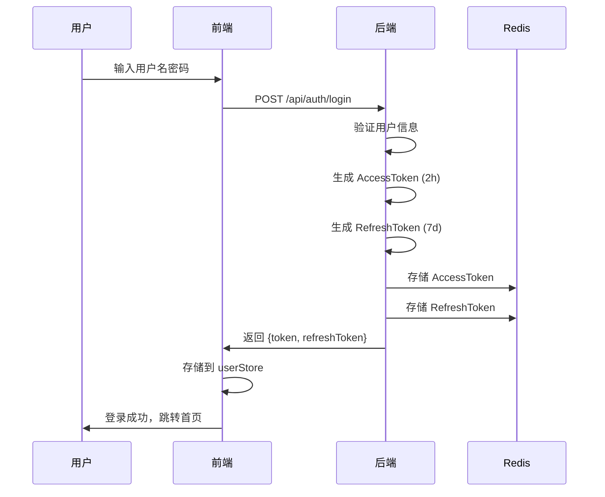
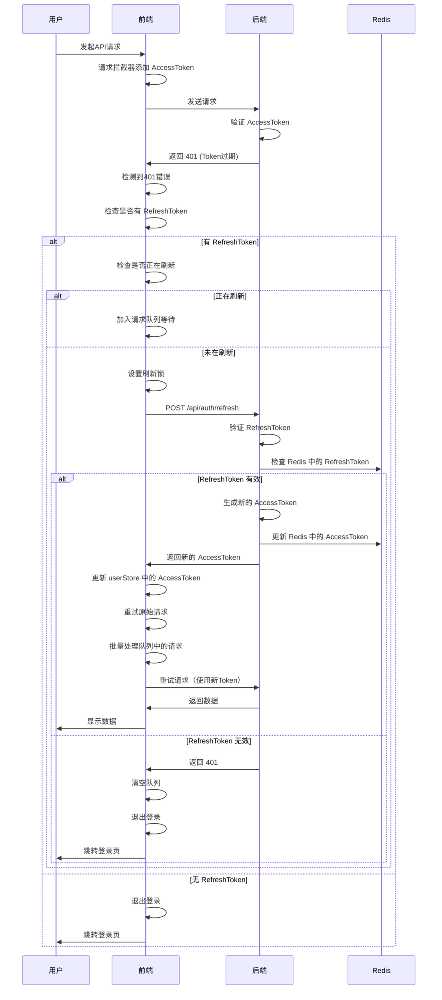
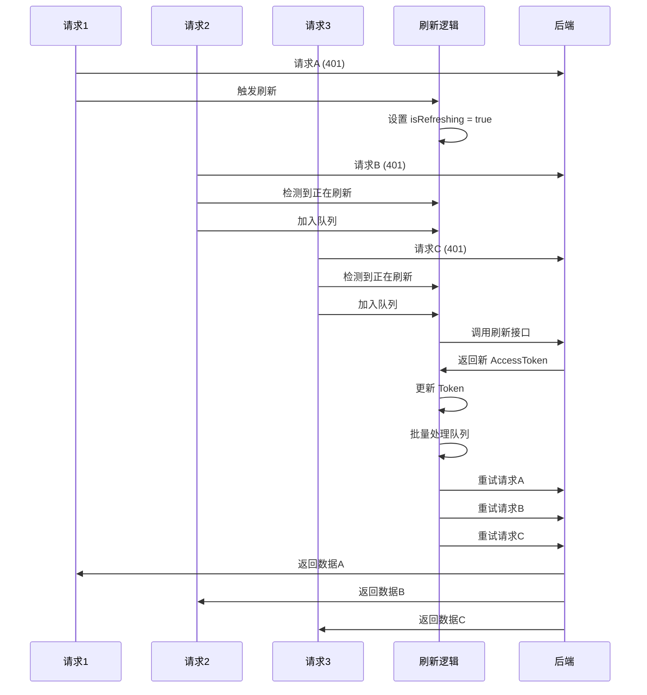

# 双Token认证实现详解

## 概述

双Token认证是一种常见的身份认证方案，通过分离访问令牌（AccessToken）和刷新令牌（RefreshToken）来提高系统的安全性和用户体验。本文档详细介绍了在 NestJS + Vue3 项目中实现双Token认证的完整过程。

## 为什么需要双Token？

### 传统单Token方案的问题

1. **安全性问题**：Token有效期过长，泄露后影响范围大
2. **用户体验问题**：Token有效期过短，用户需要频繁登录
3. **性能问题**：每次请求都需要验证Token，增加服务器负担

### 双Token方案的优势

1. **安全性**：AccessToken有效期短（如2小时），即使泄露影响范围有限
2. **用户体验**：RefreshToken有效期长（如7天），用户无需频繁登录
3. **灵活性**：可以独立管理两种Token的生命周期
4. **可控性**：可以主动撤销RefreshToken，使所有AccessToken失效

## Token类型说明

### AccessToken（访问令牌）

- **用途**：用于API请求的身份验证
- **有效期**：较短（默认2小时）
- **存储位置**：
  - 前端：`userStore.accessToken`
  - 后端：Redis（`user:token:${userId}`）
- **特点**：每次请求都需要携带，过期后需要刷新

### RefreshToken（刷新令牌）

- **用途**：用于刷新AccessToken
- **有效期**：较长（默认7天）
- **存储位置**：
  - 前端：`userStore.refreshToken`
  - 后端：Redis（`user:refresh_token:${userId}`）
- **特点**：仅在AccessToken过期时使用，不用于常规API请求

## 完整流程图

### 登录流程



### Token刷新流程



### 并发请求处理流程



## 实现架构

### 后端实现

#### 1. Token生成与存储

**登录流程：**

```typescript
async login(user: any) {
  // 1. 生成 AccessToken（2小时过期）
  const accessToken = this.jwtService.sign(payload);

  // 2. 生成 RefreshToken（7天过期）
  const refreshToken = this.jwtService.sign(refreshPayload, {
    expiresIn: '7d',
  });

  // 3. 存储到 Redis
  await Promise.all([
    // AccessToken 存储 2 小时
    this.cacheManager.set(
      getRedisKey(USER_TOKEN_KEY, userId),
      accessToken,
      accessTokenExpiresInSeconds * 1000,
    ),
    // RefreshToken 存储 7 天
    this.cacheManager.set(
      getRedisKey(USER_REFRESH_TOKEN_KEY, userId),
      refreshToken,
      refreshTokenExpiresInSeconds * 1000,
    ),
  ]);

  return { token: accessToken, refreshToken };
}
```

#### 2. Token刷新机制

**刷新流程：**

```typescript
async refresh(refreshToken: string) {
  // 1. 验证 RefreshToken
  const payload = this.jwtService.verify<JwtPayload>(refreshToken);

  // 2. 验证 Token 类型
  if (payload.type !== 'refresh') {
    throw new UnauthorizedException('无效的 Refresh Token');
  }

  // 3. 验证 Redis 中存储的 RefreshToken 是否一致
  const storedRefreshToken = await this.cacheManager.get<string>(
    getRedisKey(USER_REFRESH_TOKEN_KEY, userId),
  );

  if (!storedRefreshToken || storedRefreshToken !== refreshToken) {
    throw new UnauthorizedException('Refresh Token 无效或已过期');
  }

  // 4. 生成新的 AccessToken
  const accessToken = this.jwtService.sign(newPayload);

  // 5. 更新 Redis 中的 AccessToken（RefreshToken 保持不变）
  await this.cacheManager.set(
    getRedisKey(USER_TOKEN_KEY, userId),
    accessToken,
    accessTokenExpiresInSeconds * 1000,
  );

  return { token: accessToken };
}
```

### 前端实现

#### 1. Token存储

使用 Pinia Store 存储Token：

```typescript
const setToken = (newAccessToken: string, newRefreshToken?: string) => {
  accessToken.value = newAccessToken;
  if (newRefreshToken) {
    refreshToken.value = newRefreshToken;
  }
};
```

#### 2. HTTP拦截器实现

**请求拦截器：** 自动添加 AccessToken

```typescript
axiosInstance.interceptors.request.use((request) => {
  const { accessToken } = useUserStore();
  if (accessToken) {
    request.headers.set('Authorization', `Bearer ${accessToken}`);
  }
  return request;
});
```

**响应拦截器：** 处理401错误并自动刷新Token

```typescript
axiosInstance.interceptors.response.use(
  (response) => {
    // 正常响应
    return response;
  },
  async (error) => {
    // 处理401错误
    if (error.response?.status === 401) {
      return handleUnauthorizedResponse(error.config);
    }
    return Promise.reject(error);
  },
);
```

#### 3. Token刷新逻辑

**核心刷新机制：**

```typescript
let isRefreshing = false; // 刷新锁
let failedQueue = []; // 请求队列

async function handleUnauthorizedResponse(config) {
  const { refreshToken } = useUserStore();

  // 1. 检查是否有 RefreshToken
  if (!refreshToken) {
    return handleUnauthorizedError();
  }

  // 2. 检查是否正在刷新（防止并发）
  if (isRefreshing) {
    return new Promise((resolve, reject) => {
      failedQueue.push({ resolve, reject, config });
    });
  }

  // 3. 开始刷新
  isRefreshing = true;

  try {
    // 4. 调用刷新接口
    const { token: newAccessToken } = await fetchRefreshToken(refreshToken);

    // 5. 更新 AccessToken
    userStore.setToken(newAccessToken);

    // 6. 更新请求头并重试原始请求
    config.headers.set('Authorization', `Bearer ${newAccessToken}`);
    const response = await axiosInstance.request(config);

    // 7. 处理队列中的请求
    processQueue(newAccessToken);

    return response;
  } catch (error) {
    // 8. 刷新失败，清空队列并退出登录
    processQueue(null, error);
    return handleUnauthorizedError();
  } finally {
    isRefreshing = false;
  }
}
```

## 关键实现细节

### 1. 刷新锁机制

**目的：** 防止多个请求同时触发刷新操作

```typescript
let isRefreshing = false;

if (isRefreshing) {
  // 加入队列等待
  return new Promise((resolve, reject) => {
    failedQueue.push({ resolve, reject, config });
  });
}

isRefreshing = true;
// 执行刷新...
isRefreshing = false;
```

### 2. 请求队列管理

**目的：** 存储刷新期间失败的请求，刷新成功后批量重试

```typescript
let failedQueue: Array<{
  resolve: (value?: any) => void;
  reject: (error?: any) => void;
  config: AxiosRequestConfig;
}> = [];

function processQueue(newAccessToken: string | null, error?: any) {
  failedQueue.forEach(({ resolve, reject, config }) => {
    if (newAccessToken) {
      // 刷新成功，重试请求
      config.headers.set('Authorization', `Bearer ${newAccessToken}`);
      axiosInstance.request(config).then(resolve).catch(reject);
    } else {
      // 刷新失败，拒绝请求
      reject(error);
    }
  });
  failedQueue = [];
}
```

### 3. Redis存储策略

**AccessToken存储：**

- Key: `user:token:${userId}`
- TTL: 2小时（与JWT过期时间一致）
- 用途：验证API请求的合法性

**RefreshToken存储：**

- Key: `user:refresh_token:${userId}`
- TTL: 7天（与JWT过期时间一致）
- 用途：验证刷新请求的合法性

### 4. 时间配置管理

使用配置中心化管理Token过期时间：

```typescript
// app.config.ts
jwtAccessTokenExpiresIn: process.env.JWT_ACCESS_TOKEN_EXPIRES_IN || '2h',
jwtRefreshTokenExpiresIn: process.env.JWT_REFRESH_TOKEN_EXPIRES_IN || '7d',

// 解析时间字符串为秒数
export function parseExpiresIn(timeStr: string): number {
  const match = timeStr.match(/^(\d+)([smhd])$/);
  const value = parseInt(match[1], 10);
  const unit = match[2];

  switch (unit) {
    case 's': return value;
    case 'm': return value * 60;
    case 'h': return value * 60 * 60;
    case 'd': return value * 24 * 60 * 60;
  }
}
```

## 安全考虑

### 1. Token验证

- **JWT验证**：验证Token签名、过期时间、类型
- **Redis验证**：验证Token是否与存储的一致（防止Token被撤销后仍可使用）
- **密码版本号验证**：用户信息修改后，使旧Token失效

### 2. 防止Token泄露

- **HTTPS传输**：所有Token传输都使用HTTPS
- **HttpOnly Cookie**：可以考虑将RefreshToken存储在HttpOnly Cookie中
- **Token轮换**：刷新时可以考虑生成新的RefreshToken

### 3. 防止重放攻击

- **Token唯一性**：每次刷新都验证RefreshToken是否与Redis中存储的一致
- **过期时间控制**：AccessToken有效期短，减少泄露影响

## 错误处理

### 1. RefreshToken过期

**场景：** RefreshToken也过期了

**处理：**

- 直接退出登录
- 清空请求队列
- 提示用户重新登录

### 2. 刷新接口失败

**场景：** 网络错误或服务器错误

**处理：**

- 视为刷新失败
- 退出登录
- 提示用户检查网络连接

### 3. 并发刷新

**场景：** 多个请求同时返回401

**处理：**

- 使用刷新锁机制
- 第一个请求触发刷新
- 其他请求加入队列等待
- 刷新完成后批量重试

## 测试场景

### 1. 正常刷新流程

- AccessToken过期
- 有有效的RefreshToken
- 刷新成功，请求重试成功

### 2. RefreshToken过期

- AccessToken过期
- RefreshToken也过期
- 刷新失败，退出登录

### 3. 并发请求

- 多个请求同时返回401
- 只触发一次刷新
- 所有请求在刷新后重试

### 4. 刷新期间新请求

- 刷新进行中
- 新请求加入队列
- 刷新完成后统一重试

## 配置说明

### 环境变量

```env
# JWT配置
JWT_SECRET=your-secret-key
JWT_ACCESS_TOKEN_EXPIRES_IN=2h
JWT_REFRESH_TOKEN_EXPIRES_IN=7d
```

### Redis配置

```env
REDIS_HOST=localhost
REDIS_PORT=6379
REDIS_DB=0
REDIS_KEY_PREFIX=qm_photo
```

## 代码文件位置

### 后端

- **认证服务**：`src/modules/auth/auth.service.ts`
- **认证控制器**：`src/modules/auth/auth.controller.ts`
- **时间工具**：`src/common/helpers/date.helper.ts`
- **Redis Key常量**：`src/common/constants/redis-key.constants.ts`
- **配置文件**：`src/config/app.config.ts`

### 前端

- **HTTP拦截器**：`src/utils/http/index.ts`
- **认证API**：`src/api/auth.ts`
- **用户Store**：`src/store/modules/user.ts`

## 注意事项

1. **避免死循环**：刷新接口本身不应该触发刷新流程
2. **错误处理**：所有可能的错误情况都要处理
3. **性能优化**：请求队列不要无限增长
4. **安全性**：RefreshToken不要暴露在日志中
5. **时间同步**：确保Redis TTL与JWT过期时间一致

## 总结

双Token认证通过分离访问令牌和刷新令牌，在安全性和用户体验之间取得了良好的平衡。实现过程中需要注意：

1. **时间一致性**：确保Redis存储的TTL与JWT过期时间一致
2. **并发控制**：使用刷新锁和请求队列防止并发刷新
3. **错误处理**：完善的错误处理机制，确保用户体验
4. **安全性**：Token验证、存储安全、防止泄露

通过以上实现，我们成功构建了一个安全、可靠、用户友好的双Token认证系统。

## 参考文档

- [Token刷新机制文档](../../qm-photo-admin/docs/Token刷新机制文档.md)
- [NestJS鉴权流程完整分析](../fe_md/NestJS鉴权流程完整分析.md)
- [权限系统实现方案](../fe_md/权限系统实现方案.md)
